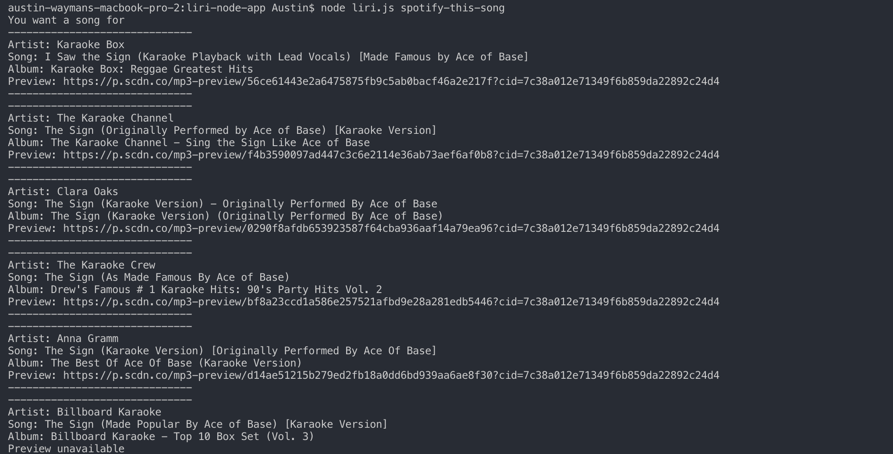
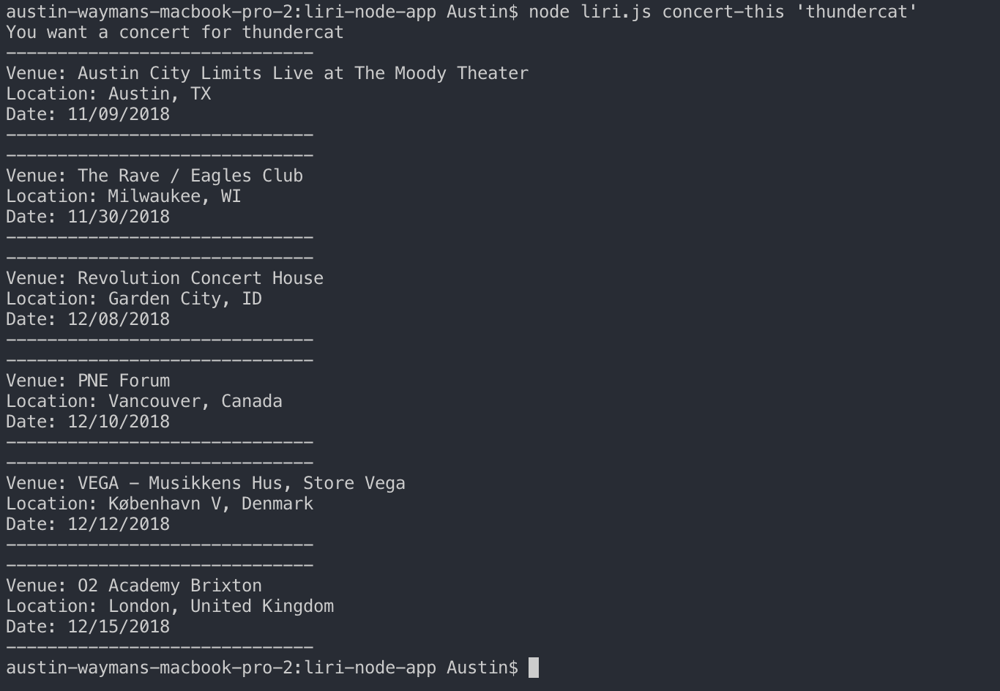
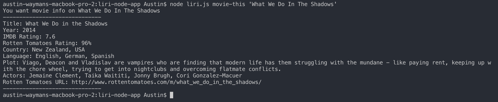
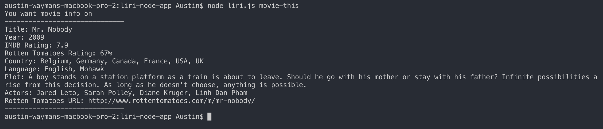
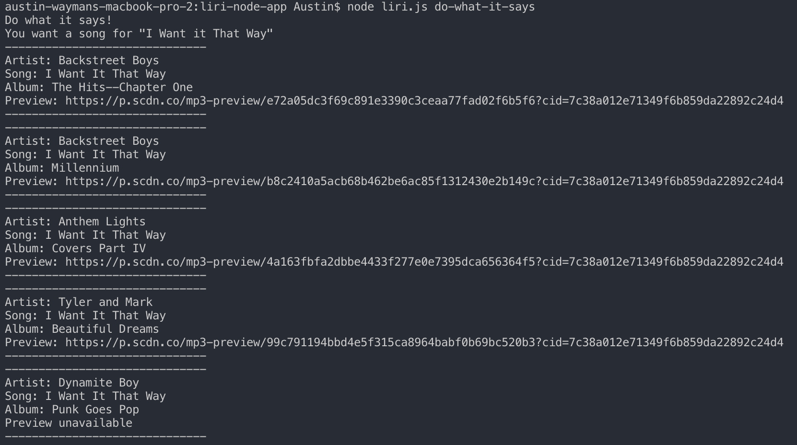

# Welcome to the Liri App!
Welcome to Liri, your virtual assistant! This site can be used to search:
  - A song using Spotify,
  - An artist's next few concert dates using BandsInTown,
  - Or your information on your favorite movie using OMDb!

 

## How-to
---
1. To search for a song:
 
`node liri.js spotify-this-song '<insert song name>'`

  * OR by default, if nothing is searched then you will get:

2. To search for tour dates:
 
`node liri.js concert-this '<insert artist name>'`

3. To search for movie information:
 
`node liri.js movie-this '<insert movie name>'`

  * OR by default, if nothing is searched then you will get:

4. To search for whatever is in the random.txt file:
 
`node liri.js do-what-it-says`
